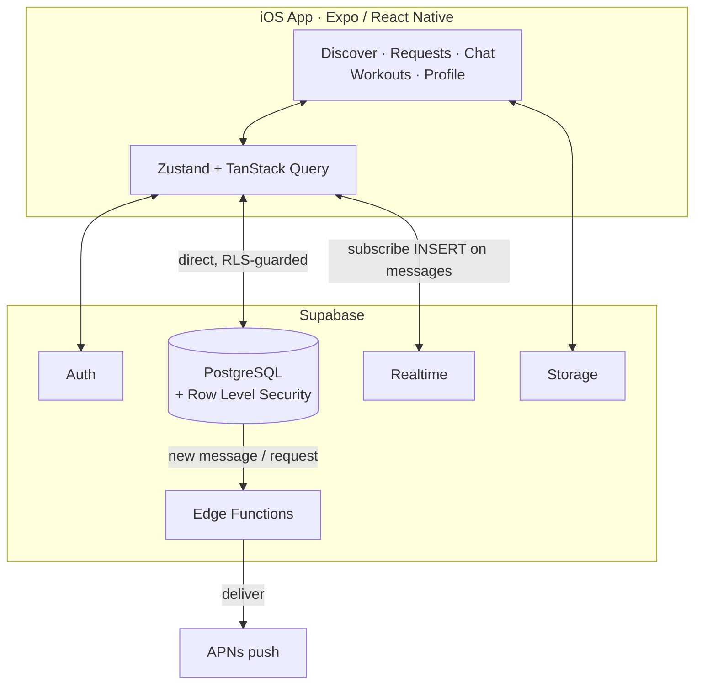

<div align="center">

# GymStride

### Find your workout partner — at the gym or on the run.

*Browse nearby lifters and runners, send a personal chat request, and the moment they accept you're talking in real time.*

<!-- Drop a banner/hero image at docs/assets/banner.png and it will render here -->


[](https://apps.apple.com/us/app/gymstride/id6769993847)


**Live on the App Store →** <https://apps.apple.com/us/app/gymstride/id6769993847>

</div>

---

## What GymStride is

GymStride is a location-aware iOS app for meeting people to train with. You see who's
nearby — filtered by what they're into, gym or running — send one **personal chat
request** with a note, and once they accept you drop straight into **real-time 1:1
messaging**. No cold follows, no public DMs, no swiping.

Built end-to-end as a solo senior project: React Native frontend, Supabase backend,
shipped through EAS Build and **live on the App Store** after passing App Review.

> The hard parts of this project weren't the product logic — they were the
> infrastructure: database-enforced access control, real-time plumbing, and the gap
> between "works on localhost" and "passes App Review."

---

## The one idea that makes it work: the database is the backend

GymStride has **no application server**. There is no Node API enforcing who can read
what, no middleware layer checking permissions on every request. Every access rule —
*you only see profiles in your region, only read conversations you're a part of, only
write your own messages* — is enforced by **PostgreSQL Row Level Security** right where
the data lives. The mobile app talks to Supabase directly; the database says no.

That keeps the surface tiny and impossible to bypass, but it pushes all the difficulty
into the policy layer. The sharpest edge: a cross-table RLS policy on
`conversation_participants` sends Postgres's policy evaluator into **infinite recursion**
(error `42P17`). The fix is a `SECURITY DEFINER` function that steps *outside* RLS for
internal lookups — a full day of debugging a vague recursion error with no stack trace.

```sql
-- participants can read only their own rows
create policy "participants: read own"
  on conversation_participants for select
  using (profile_id = auth.uid());

-- accept / decline run as SECURITY DEFINER to bypass RLS
-- (direct writes to conversations are blocked for regular users)
create or replace function accept_chat_request(p_request_id uuid)
returns uuid language plpgsql security definer as $$
  ...
$$;
```

---

## Architecture in one glance



Access control lives in the database, not in a server. The app is a direct,
RLS-guarded client.

---

## The chat request flow

```
Requester  →  INSERT chat_request  (status: pending)

Recipient  →  accept:  RPC creates conversation + participants rows
           →  decline: RPC deletes the request row

Requester  →  cancel:  DELETE policy on own pending requests
```

**Rate limiting is a query, not infrastructure:** before the request modal opens, a count
on `chat_requests` filtered to `created_at >= now() - interval '24 hours'` decides whether
you're allowed to send another. No queue, no Redis, no rate-limit service.

---

## Repository layout

```
gymstride/
├── app/                  # Expo Router v6 — file-based, typed routes
│   ├── (tabs)/           # discover · requests · chat · workouts · profile
│   ├── chat/[id].tsx     # 1:1 conversation screen (realtime)
│   └── auth/             # sign in / sign up
├── src/
│   ├── lib/              # supabase client · session
│   ├── stores/           # Zustand state
│   ├── queries/          # TanStack Query hooks
│   └── components/       # shared UI
├── supabase/
│   ├── migrations/       # schema + RLS policies + RPC functions
│   └── functions/        # Edge Functions (push on message / request)
└── assets/
```

---

## What GymStride does today

| Capability | State | Notes |
|---|---|---|
| Nearby discovery | Done | Location-aware, filtered by workout type. |
| Personal chat requests | Done | One request + a note; no cold follows. |
| Real-time 1:1 messaging | Done | Supabase Realtime `INSERT` subscription, no polling. |
| Accept / decline / cancel | Done | `SECURITY DEFINER` RPCs, RLS-guarded. |
| Workout logging | Done | Gym · long run · short run · sprint. |
| Streak badges | Done | Earned from logged workouts. |
| Push notifications | Done | Edge Function → APNs on message / request. |
| Row Level Security | Done | Every table; the database is the access layer. |
| App Store release | Done | Live, passed App Review. |

---

## Stack

| Layer | Technology |
|---|---|
| Mobile | React Native 0.81 / Expo SDK 54 |
| Routing | Expo Router v6 (file-based, typed) |
| Backend | Supabase — PostgreSQL, Auth, Realtime, Storage |
| Client state | Zustand |
| Server state | TanStack Query v5 |
| Gestures | react-native-gesture-handler |
| Keyboard | react-native-keyboard-controller |
| Notifications | expo-notifications + APNs |
| Build & submit | EAS Build + EAS Submit |
| Language | TypeScript throughout |

---

## Running locally

Requires **Node 18+** and the Expo tooling.

```bash
git clone https://github.com/selimfedakar/gymstride.git
cd gymstride
npm install
cp .env.example .env
# Fill in EXPO_PUBLIC_SUPABASE_URL and EXPO_PUBLIC_SUPABASE_ANON_KEY
npx expo start
```

Apply the migrations in `supabase/migrations/` in order via Supabase's SQL editor, then
deploy the Edge Functions in `supabase/functions/` with the Supabase CLI.

### Build & submit

```bash
eas build  --platform ios --profile production
eas submit --platform ios --profile production
```

---

## What I learned

Most of the difficulty lived in the infrastructure, not the product. Debugging RLS
policies when Postgres hands you a vague recursion error with no stack trace; wiring
gesture handlers so they work across the entire React tree; designing auth flows that
don't hang when a network call stalls on a tunnel connection. As a senior student
shipping a real app to a real store for the first time, the distance between
*"it works on localhost"* and *"it passes App Review"* turned out to be a real part of
the project — and the part that taught the most.

---

## License

MIT
